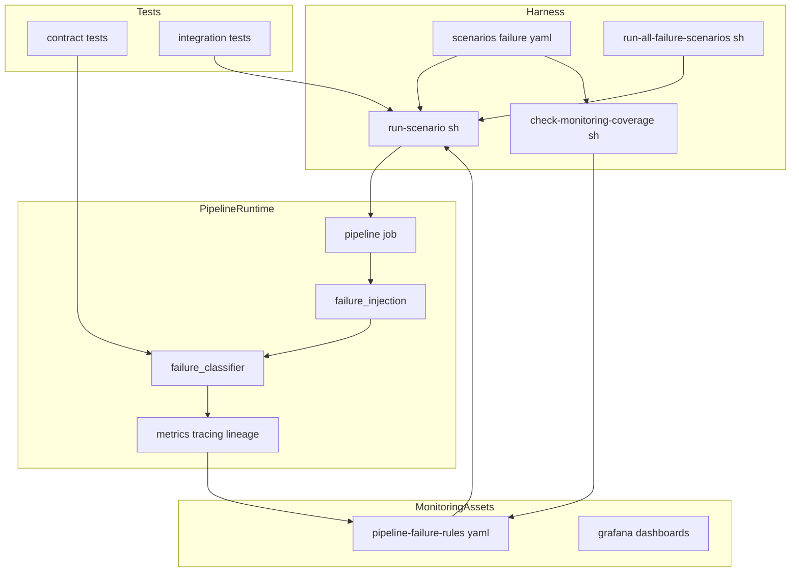
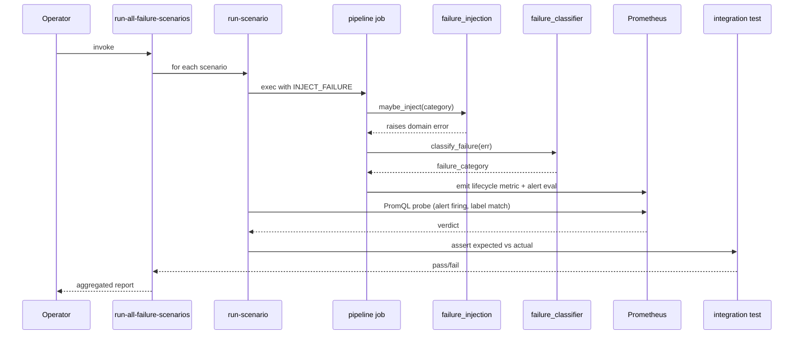

# Design Document — monitor-error-case-coverage

## Overview
**Purpose**: 驗證 `ai-monitor-system` 的「**錯誤偵測能力**」：在 9 種 pipeline 失敗情境下，監控系統（metrics、traces、lineage、alerts）能否正確偵測、分類、關聯、通報。觀測對象為 pipeline，**不**驗證監控元件本身的穩定性 / 延遲（meta-monitoring 屬另一規格）。
**Users**: 平台操作員、資料工程師、工程主管，作為日常 triage、新管線 onboarding 與監控可行性審查的證據。
**Impact**: 既有 pipeline 增加可控的失敗注入點；`scenarios/`、`monitoring/alerts/`、`tests/` 三層分別獲得 9 種分類覆蓋；`docs/runbook.md` 與 `docs/validation-report.md` 增補章節以對齊每個分類。

### Goals
- 9 個 `KNOWN_CATEGORIES` 分類各有可重現的情境檔、告警驗證與 runbook 章節。
- 失敗分類器輸出與 metric label、alert label、runbook 章節完全對齊。
- 一鍵執行所有失敗情境並產出彙總驗證報告。
- 額外提供 `schema-mismatch` 情境，驗證 schema 觸發失敗仍能被偵測（含 lineage 的 run 狀態可達性）。

### Non-Goals
- 新增 `KNOWN_CATEGORIES` 之外的分類。
- 驗證監控元件本身的穩定性、延遲、SLO（meta-monitoring）。
- 驗證 OpenLineage facet 內容正確性（schema、column lineage、欄位數比對）。
- 偵測「成功 run 之間的 schema drift」。
- 修改 pipeline 商業邏輯或更換監控元件。
- 多叢集或雲端託管環境驗證。

## Boundary Commitments

### This Spec Owns
- `scenarios/<failure>.yaml` 9 個失敗分類情境 + 1 個 `schema-mismatch.yaml`（lineage facet 驗證情境）與 schema 擴充。
- `pipeline/failure_injection.py` 新模組（依 `INJECT_FAILURE` env 觸發特定錯誤路徑，含 `schema_mismatch` 子取值）。
- `scripts/probe.py` 新增 `lineage-run-state` probe 類型（唯讀查詢 lineage 後端的 run state，僅斷言 `FAILED`；不查 facet 內容）。
- `monitoring/alerts/pipeline-failure-rules.yaml` 新告警群（混合策略）。
- `tests/contract/test_failure_classifier_contract.py` 與 `tests/integration/test_failure_alerts.py` 的失敗分類覆蓋擴充。
- `docs/runbook.md`、`docs/validation-report.md` 對應章節。
- `deploy/scripts/check-monitoring-coverage.sh` 對 scenario schema 與 runbook 對齊的驗證步驟。
- `scripts/run-all-failure-scenarios.sh` 新增彙總執行入口。

### Out of Boundary
- 變更 `failure_classifier.py` 既有分類邏輯與 `KNOWN_CATEGORIES`（schema 不匹配沿用 `spark_driver_error`，不新增分類）。
- 驗證監控元件本身（OTel collector、Prometheus、Marquez、Grafana）的穩定性 / 延遲 / SLO（meta-monitoring）。
- 驗證 OpenLineage facet 內容（schema、column lineage、欄位數比對）；本規格僅斷言 lineage 後端是否收到失敗 run 的終態事件。
- 變更遙測 schema、run id 產生邏輯、Helm chart 結構。
- 對「成功 run 之間的 schema drift 偵測」（屬另一規格）。
- Grafana dashboard 視覺重構（僅允許在既有 panel 增加 query）。

### Allowed Dependencies
- 既有 `pipeline/run_context.py`、`tracing.py`、`lineage_emitter.py`、`metrics.py`。
- 既有 scenario runner（`scripts/run-scenario.sh`、`scripts/probe.py`）。
- lineage 後端 HTTP API（read-only，僅取 run state；如 Marquez `GET /api/v1/namespaces/<ns>/jobs/<job>/runs/<run_id>` 之 `state` 欄位）作為 lineage 偵測路徑驗證面，不取 facet 內容。
- 既有 Helm chart 與 values；新 alert rule 透過既有 ConfigMap 機制注入。

### Revalidation Triggers
- `KNOWN_CATEGORIES` 變更（新增 / 刪除分類）。
- run lifecycle metric label schema 變更（特別是 `failure_category`）。
- scenario YAML schema 必填欄位變更。
- `INJECT_FAILURE` env 契約變更或被移除。

## Architecture

### Existing Architecture Analysis
- 三層既有結構：**pipeline runtime**（Python）、**monitoring assets**（alerts / dashboards）、**scenario harness**（scripts + YAML + tests）。
- `failure_classifier.classify_failure()` 已是分類權威來源，所有新元件皆消費其輸出，不重新實作分類規則。
- scenario runner 以 PromQL probe 為唯一驗證機制，不直接讀 trace/lineage 後端，避免被測元件失效時 probe 也失效。

### Architecture Pattern & Boundary Map



**Architecture Integration**:
- Selected pattern: harness-driven extension（既有 scenario runner 為樞紐，新增資產透過 schema 與 PromQL probe 整合）。
- Domain/feature boundaries: 注入邏輯封裝於 `failure_injection`；分類仍由 `failure_classifier` 集中；告警與 runbook 為消費端。
- Existing patterns preserved: scenario YAML + PromQL probe、env-driven pipeline、helm-managed alert rule。
- New components rationale: `failure_injection` 集中錯誤注入避免散落於 pipeline；`pipeline-failure-rules.yaml` 隔離失敗類告警便於維護；`run-all-failure-scenarios.sh` 提供一鍵驗證。
- Steering compliance: 配置優先（YAML schema + env）、observability-first（每個情境必有對應告警與 runbook）、tests 與行為同層。

### Technology Stack

| Layer | Choice / Version | Role in Feature | Notes |
|-------|------------------|-----------------|-------|
| Pipeline runtime | Python 3.11、PySpark | `failure_injection` 模組、現有 classifier | 維持既有版本 |
| Harness | bash + Python（PyYAML） | scenario runner 擴充、彙總入口 | 沿用 `scripts/probe.py` |
| Monitoring | Prometheus alerting rules、Grafana | 新 alert group、既有面板 | 透過既有 ConfigMap 注入 |
| Tests | pytest | contract / integration suites | 沿用 `pytest.ini` |
| Docs | Markdown | runbook / validation report 章節 | 與 schema 雙向對齊 |

## File Structure Plan

### Directory Structure
```
ai-monitor-system/
├── pipeline/
│   └── failure_injection.py          # 新：依 INJECT_FAILURE 觸發對應錯誤
├── scenarios/
│   ├── success-baseline.yaml          # 修：補 expected_* 欄位
│   ├── input-not-found.yaml           # 新
│   ├── invalid-path.yaml              # 新
│   ├── permission-denied.yaml         # 新
│   ├── spark-task-failed.yaml         # 新
│   ├── spark-driver-error.yaml        # 新
│   ├── lineage-emission-failed.yaml   # 新
│   ├── telemetry-unavailable.yaml     # 新
│   ├── timeout.yaml                   # 新
│   ├── runtime-error.yaml             # 新
│   └── schema-mismatch.yaml           # 新：spark_driver_error + lineage facet 驗證
├── monitoring/alerts/
│   └── pipeline-failure-rules.yaml    # 新：混合策略告警群
├── scripts/
│   ├── run-scenario.sh                # 修：載入 expected_failure_category
│   └── run-all-failure-scenarios.sh   # 新：彙總執行 + 報告輸出
├── deploy/scripts/
│   └── check-monitoring-coverage.sh   # 修：scenario schema + runbook 對齊
├── tests/
│   ├── contract/test_failure_classifier_contract.py   # 修：覆蓋 9 分類
│   └── integration/test_failure_alerts.py             # 修：以情境 fixture 驗證告警
└── docs/
    ├── runbook.md                     # 修：每分類一節
    └── validation-report.md           # 修：每情境最近驗證紀錄
```

### Modified Files
- `pipeline/job.py` — 在 pipeline 入口呼叫 `failure_injection.maybe_inject()`，預設 `INJECT_FAILURE=none` no-op。
- `scripts/run-scenario.sh` — 將 `expected_failure_category` / `expected_alerts` 透過 env 傳入測試 hook，並在情境結束時驗證 metric label 與 alert 名稱。
- `scripts/probe.py` — 新增 `lineage-run-state` cmd，唯一斷言為 `state_eq=FAILED`（不查 facet 內容、不查欄位數）。
- `deploy/scripts/check-monitoring-coverage.sh` — 增加 (1) scenario schema 驗證、(2) `KNOWN_CATEGORIES` 與 runbook 章節對齊檢查、(3) `schema-mismatch` 情境含 lineage-run-state probe 的存在性檢查。

## System Flows



關鍵決策：probe 不直接查 lineage / OTel 後端，而以 Prometheus 為共同驗證面；當被測後端為 `lineage_emission_failed` / `telemetry_unavailable` 時，pipeline 仍須能以 lifecycle metric 揭露失敗。

## Requirements Traceability

| Requirement | Summary | Components | Interfaces | Flows |
|-------------|---------|------------|------------|-------|
| 1.1 | 9 分類各一情境 | scenarios/*.yaml | Scenario YAML schema | Sequence |
| 1.2 | runner 觸發失敗並非零退出 | run-scenario, failure_injection | env contract `INJECT_FAILURE` | Sequence |
| 1.3 | 情境宣告 expected 欄位 | Scenario YAML schema | YAML schema | — |
| 1.4 | schema 缺欄位即中止 | run-scenario, coverage check | YAML schema | — |
| 2.1 | classifier 回傳預期類別 | failure_classifier | service interface | Sequence |
| 2.2 | failure_category 寫入 metric label | metrics, run_context | metric label contract | Sequence |
| 2.3 | runtime_error 退化即測試失敗 | contract tests | assertion contract | — |
| 2.4 | contract 覆蓋全分類 | contract tests | pytest cases | — |
| 3.1 | run_id 一致 | run_context, telemetry | run_id contract | Sequence |
| 3.2 | trace 含 error span | tracing, integration tests | OTel span attr | Sequence |
| 3.3 | collector 不可達 fallback | tracing, failure_injection | local fallback | Sequence |
| 3.4 | lineage backend 拒絕之降級 | lineage_emitter, metrics | lifecycle metric | Sequence |
| 3.5 | schema 不匹配走三路偵測 | failure_injection, metrics, tracing, lineage_emitter | metric label, OTel error span, lineage run state | Sequence |
| 3.6 | lineage 後端收到 FAILED run | scripts/probe.py (lineage-run-state), integration tests | lineage HTTP API | Sequence |
| 4.1 | alert firing | pipeline-failure-rules | alert rule | Sequence |
| 4.2 | coverage check 對齊 alert | check-monitoring-coverage | static check | — |
| 4.3 | dashboard 顯示失敗 | grafana dashboards | dashboard query | — |
| 4.4 | 未觸發即測試失敗 | integration tests | PromQL probe | Sequence |
| 5.1 | runbook 每分類一節 | docs/runbook.md | doc convention | — |
| 5.2 | validation report 條目 | docs/validation-report.md | doc convention | — |
| 5.3 | coverage check 拒絕缺章節 | check-monitoring-coverage | static check | — |
| 5.4 | 一鍵重跑入口 | run-all-failure-scenarios | CLI contract | Sequence |

## Components and Interfaces

| Component | Domain/Layer | Intent | Req Coverage | Key Dependencies (P0/P1) | Contracts |
|-----------|--------------|--------|--------------|--------------------------|-----------|
| FailureInjection | pipeline | 依 `INJECT_FAILURE` 觸發對應錯誤路徑 | 1.2, 2.1, 3.3 | run_context (P0), io_adapter (P1) | Service |
| ScenarioSchema | harness | 定義 scenario YAML 必填欄位與驗證 | 1.1, 1.3, 1.4 | run-scenario (P0), coverage check (P0) | Batch |
| ScenarioRunnerExt | harness | 在 runner 執行後比對 expected vs actual | 1.2, 2.1, 4.1, 4.4, 3.6 | probe.py (P0), Prometheus (P0), lineage backend (P1) | Batch |
| LineageRunStateProbe | harness | probe.py 子命令；查 lineage 後端的 run 終態 | 3.5, 3.6 | lineage backend HTTP API (P0) | Batch |
| PipelineFailureRules | monitoring | 9 分類混合策略告警群 | 4.1, 4.2 | Prometheus (P0), classifier metric (P0) | Event |
| CoverageCheckExt | harness | 驗證 scenario schema 與 runbook 對齊 | 1.4, 4.2, 5.3 | scenarios, runbook (P0) | Batch |
| RunAllFailureScenarios | harness | 一鍵彙總執行與報告 | 5.4, 4.4 | run-scenario (P0) | Batch |
| FailureContractTests | tests | 覆蓋 9 分類分類器行為 | 2.1, 2.3, 2.4 | classifier (P0) | Service |
| FailureAlertIntegrationTests | tests | 驗證告警與 metric/trace 關聯 | 3.1, 3.2, 4.1, 4.4 | runner, Prom (P0) | Batch |
| RunbookFailureSections | docs | 每分類一節 runbook | 5.1 | classifier categories (P0) | — |
| ValidationReportLedger | docs | 每情境最近驗證結果 | 5.2 | run-all output (P0) | — |

### Pipeline Layer

#### FailureInjection

| Field | Detail |
|-------|--------|
| Intent | 集中管理「為驗證監控而注入的錯誤」並將真實異常交給既有 classifier |
| Requirements | 1.2, 2.1, 3.3 |

**Responsibilities & Constraints**
- 唯一入口 `maybe_inject(category: str | None, *, stage: Literal["pre_spark", "during_spark", "post_spark"]) -> None`；`None`/`"none"` 為 no-op。
- 僅在 `INJECT_FAILURE` 明示時生效；不得在生產 helm values 中曝露。
- 不得自行決定 `failure_category`；分類仍由 `failure_classifier.classify_failure` 推導。
- **注入階段必須與真實失敗發生階段一致**，避免「假失敗」繞過 tracing / lineage 真實路徑。每個分類的階段固定如下：

| 注入分類 | 觸發階段 | 觸發點（呼叫位置） | 對應真實失敗 |
|----------|----------|-------------------|--------------|
| `input_not_found` | `pre_spark` | `io_adapter.resolve_input` 前 | 路徑檢查階段 `FileNotFoundError` |
| `invalid_path` | `pre_spark` | 同上 | `IsADirectoryError` |
| `permission_denied` | `pre_spark` | 同上 | 路徑檢查階段 `PermissionError` |
| `timeout` | `pre_spark` | 外部呼叫前 wrapper | requests / socket timeout |
| `runtime_error` | `pre_spark` | pipeline 入口 | 一般 `RuntimeError` |
| `spark_task_failed` | `during_spark` | DataFrame transformation 中 `udf` | Spark task 階段 `Py4JJavaError` |
| `spark_driver_error` | `during_spark` | DataFrame action 前注入 driver-side 例外 | 驅動端 `SparkException` |
| `schema_mismatch` | `during_spark` | read 後 schema 校驗 | `AnalysisException` / 型別錯誤 |
| `lineage_emission_failed` | `post_spark` | lineage emitter flush 階段 | lineage HTTP 拒絕 |
| `telemetry_unavailable` | `post_spark` | otel 匯出階段 | collector 不可達 |

- `during_spark` 與 `post_spark` 注入必須在實際 Spark / emitter 路徑內執行；不得改以 `pre_spark` 提前拋例外取代。

**Dependencies**
- Inbound: `pipeline.job` — 在 pipeline 啟動點呼叫（P0）。
- Outbound: `pipeline.io_adapter`、`pipeline.tracing` — 依分類觸發實際錯誤路徑（P1）。
- External: 無新增外部依賴。

**Contracts**: Service [x] / API [ ] / Event [ ] / Batch [ ] / State [ ]

##### Service Interface
```python
from typing import Literal

SUPPORTED_INJECTIONS = frozenset({
    "none",
    "input_not_found",
    "invalid_path",
    "permission_denied",
    "spark_task_failed",
    "spark_driver_error",
    "schema_mismatch",
    "lineage_emission_failed",
    "telemetry_unavailable",
    "timeout",
    "runtime_error",
})

InjectionStage = Literal["pre_spark", "during_spark", "post_spark"]

def maybe_inject(category: str | None, *, stage: InjectionStage) -> None: ...
```
- Preconditions: `category` 必須屬於 `SUPPORTED_INJECTIONS`；`stage` 必須與該分類的固定階段相符（見上表），否則拋 `ValueError`（fail fast）。
- Postconditions: 當 `category != "none"` 且 stage 相符時，函式以對應例外類型結束；其他情形正常返回。
- Invariants: 不直接寫 metric / trace；不吞例外；分類與階段對應為單一事實來源（避免散落於 pipeline 各處）。

**Implementation Notes**
- Integration: `pipeline/job.py` 在三個固定點呼叫 `maybe_inject(env, stage=...)`：(1) 輸入解析前 (`pre_spark`)；(2) DataFrame action 執行前/UDF 內 (`during_spark`)；(3) telemetry / lineage flush 前 (`post_spark`)。
- Validation: contract test 對每個 `SUPPORTED_INJECTIONS` 驗證 (a) 階段不符時為 no-op、(b) 階段相符時拋出符合 `failure_classifier` 期望的例外類型；`none` 在所有階段皆為 no-op。
- Risks: 注入點被誤用於生產；緩解：env gate + helm values 不含此鍵 + coverage check 驗證 production overlay 無 `INJECT_FAILURE`。

### Harness Layer

#### ScenarioSchema

| Field | Detail |
|-------|--------|
| Intent | 為 scenario YAML 增加可驗證的失敗期望欄位 |
| Requirements | 1.1, 1.3, 1.4 |

**Responsibilities & Constraints**
- 必填欄位：`name`、`description`、`pipeline.inject_failure`、`expected_run_status`、`expected_failure_category`、`expected_alerts`、`probes`。
- `expected_failure_category` 必須屬於 `KNOWN_CATEGORIES` 或為 `null`（`success` 情境）。
- `expected_alerts` 為 alertname 字串陣列（可空，僅 success 情境）。

**Contracts**: Service [ ] / API [ ] / Event [ ] / Batch [x] / State [ ]

##### Batch / Job Contract
- Trigger: 由 `run-scenario.sh` 與 `check-monitoring-coverage.sh` 在啟動前載入。
- Input / validation: YAML 解析 + jsonschema-style 必填檢查；缺欄即非零退出並列出缺項。
- Output / destination: 解析後以環境變數與 JSON 暫存交給 runner。
- Idempotency & recovery: 純讀取，無副作用。

#### ScenarioRunnerExt

| Field | Detail |
|-------|--------|
| Intent | 將 expected 欄位整合進 runner 結束時的判斷 |
| Requirements | 1.2, 2.1, 4.1, 4.4 |

**Contracts**: Batch [x]

##### Batch / Job Contract
- Trigger: `scripts/run-scenario.sh <name>`。
- Input / validation: ScenarioSchema 驗證後的物件。
- Output / destination: stdout 結構化 verdict（含 expected vs actual `failure_category`、alert 比對結果），結束碼 0/1。
- Idempotency & recovery: 每次執行皆為獨立 run；不跨 run 共享狀態。

**Implementation Notes**
- Integration: 透過 PromQL `pipeline_run_duration_seconds_count{status="failed",failure_category="<x>"}` 與 `ALERTS{alertname="<x>",alertstate="firing"}` 驗證；`schema-mismatch` 情境額外呼叫 LineageRunStateProbe。
- Risks: alert `for:` 視窗導致 false negative；緩解：probe `within` ≥ 180s 並允許情境覆寫。

#### LineageRunStateProbe

| Field | Detail |
|-------|--------|
| Intent | 驗證 lineage 偵測路徑可達：失敗 run 的終態事件確實送達 lineage 後端 |
| Requirements | 3.5, 3.6 |

**Responsibilities & Constraints**
- 唯讀：僅 `GET` lineage 後端 HTTP API；不查 facet 內容、不變動 lineage schema。
- 唯一斷言：`state == FAILED`（或後端等義詞）。
- 端點透過 env（如 `LINEAGE_BACKEND_URL`）注入；超時預設 5s，由情境 `within` 覆寫。
- 失敗模式：HTTP 非 2xx、找不到 run、state 不為 `FAILED` → probe FAIL。

**Contracts**: Batch [x]

##### Batch / Job Contract
- Trigger: scenario YAML 的 probe 項，`cmd: lineage-run-state`。
- Input / validation:
  - `args.namespace`、`args.job`、`args.run_id_source`（`from_metric` 或情境注入）。
  - `args.assert.state_eq`（預設 `FAILED`，唯一允許值）。
- Output / destination: stdout verdict 行（`PASS lineage-run-state …` / `FAIL …`）。
- Idempotency & recovery: 純讀取，可重試。

**Implementation Notes**
- Integration: 與 ScenarioRunnerExt 共用 run_id 解析（從 lifecycle metric label 推導）。
- Validation: contract test 以 mock 回應驗 PASS / FAIL 分支；integration test 走 in-cluster lineage 後端。
- Risks: lineage 寫入非同步延遲；緩解：probe `within` 預設 60s 並輪詢。
- Boundary note: 本 probe **不**驗證 lineage facet 內容、不驗 schema 欄位數；那屬於 lineage 後端的行為驗證，不在本規格範圍。
- **後端可達性語意（無 SKIP）**: lineage 後端為前置條件，不引入 SKIP 狀態。
  - probe 結果僅有 `PASS` / `FAIL` 二態；HTTP 不可達、超時、找不到 run、state 不為 `FAILED` 一律 `FAIL`。
  - `RunAllFailureScenarios` 的 ledger 同樣只記 `pass` / `fail`；無 `skipped`。
  - `check-monitoring-coverage.sh` 在啟動時偵測 `LINEAGE_BACKEND_URL` 健康端點；不可達即整體 coverage 檢查 FAIL（不允許跳過）。

#### CoverageCheckExt

| Field | Detail |
|-------|--------|
| Intent | 在 CI / 本地確認 scenario、alert、runbook 三方對齊 |
| Requirements | 1.4, 4.2, 5.3 |

**Contracts**: Batch [x]

##### Batch / Job Contract
- Trigger: `deploy/scripts/check-monitoring-coverage.sh`。
- Input / validation:
  1. 讀 `KNOWN_CATEGORIES`（透過 `python -c` 反射）。
  2. 對每分類驗證：存在情境檔、`runbook.md` 章節 anchor、alert rule 名稱在 `pipeline-failure-rules.yaml`。
- Output / destination: stdout 報告 + 非零退出於缺漏。
- Idempotency & recovery: 純檢查。

#### RunAllFailureScenarios

| Field | Detail |
|-------|--------|
| Intent | 提供操作員一鍵重跑全部失敗情境並彙總 |
| Requirements | 5.4, 4.4 |

**Contracts**: Batch [x]

##### Batch / Job Contract
- Trigger: `scripts/run-all-failure-scenarios.sh [--update-report]`。
- Input / validation: 讀取 `scenarios/` 目錄中所有 `expected_run_status=failed` 的情境。
- Output / destination: `docs/validation-report.md` 的 ledger 段（當 `--update-report`），以及 stdout 摘要。
- Result states: 僅 `pass` / `fail` 二態，**不**引入 `skipped`；前置條件（lineage 後端、Prometheus）若不可達，整體執行 FAIL 而非略過。
- Idempotency & recovery: 每情境之間互不依賴；任一失敗不阻擋後續情境執行，但最終以非零退出。

### Monitoring Layer

#### PipelineFailureRules

| Field | Detail |
|-------|--------|
| Intent | 提供 9 分類混合策略告警群 |
| Requirements | 4.1, 4.2 |

**Contracts**: Event [x]

##### Event Contract
- Published events: Prometheus alerts。
  - 獨立 alert：`PipelineSparkDriverError`、`PipelineLineageEmissionFailed`、`PipelineTelemetryUnavailable`、`PipelineRunTimeout`。
  - 共用 alert：`PipelineRunFailed{failure_category=...}` 涵蓋 `input_not_found`、`invalid_path`、`permission_denied`、`spark_task_failed`、`runtime_error`。
- Subscribed events: 無（消費 metric）。
- Ordering / delivery guarantees: 沿用 Prometheus 評估語意；`for:` 預設 30s 以縮短情境驗證時窗。

**Implementation Notes**
- Integration: 透過既有 ConfigMap 載入；不變動 chart 結構。
- Validation: integration test 對每條規則執行至少一次「情境觸發 → alert firing」驗證。
- Risks: label 漂移；緩解：coverage check 對 alertname 與 `failure_category` label 做 cross-check。

### Tests Layer

#### FailureContractTests

| Field | Detail |
|-------|--------|
| Intent | 確保分類器對 9 分類輸入回傳期望字串 |
| Requirements | 2.1, 2.3, 2.4 |

**Contracts**: Service [x]

##### Service Interface
- Pytest parametrized cases: 對 `KNOWN_CATEGORIES` 每一類提供至少一個構造例外（如 `FileNotFoundError`、`PermissionError`、模擬 `Py4JJavaError`、`requests.ConnectionError`）。
- 退化檢測：當輸入屬可分類例外卻被歸為 `runtime_error` 時 fail。

#### FailureAlertIntegrationTests

| Field | Detail |
|-------|--------|
| Intent | 透過 runner 端對端驗證 metric label、alert firing 與 trace error span |
| Requirements | 3.1, 3.2, 4.1, 4.4 |

**Contracts**: Batch [x]

##### Batch / Job Contract
- Trigger: pytest 啟動 `run-scenario.sh` 子流程或重用其 Python 入口。
- Input / validation: 情境 YAML 為 fixture；每情境驗證：(1) lifecycle metric `failure_category` 標籤；(2) alert firing；(3) trace span 中至少一個 `error=true`。
- Output / destination: pytest 結果。
- Idempotency & recovery: 每測試用獨立 run_id；測試間不共享 Prometheus 狀態（採時間窗篩）。

### Docs Layer

#### RunbookFailureSections / ValidationReportLedger
- Summary-only：以 Markdown anchor 與每分類 1:1。
- Implementation Note: anchor 命名 `## failure-<category>`，coverage check 以正則驗證；validation ledger 以表格列出 `scenario | last_run_at | result | run_id`。

## Data Models

### Logical Data Model — Scenario YAML
```
Scenario
├── name: string (unique, kebab-case)
├── description: string
├── pipeline
│   ├── input_records: int
│   └── inject_failure: enum(SUPPORTED_INJECTIONS)
├── expected_run_status: enum(succeeded|failed)
├── expected_failure_category: enum(KNOWN_CATEGORIES) | null
├── expected_alerts: list<string>
└── probes: list<Probe>
```
- Natural key: `name`。
- Referential integrity: `inject_failure` 對齊 `SUPPORTED_INJECTIONS`；`expected_failure_category` 對齊 `KNOWN_CATEGORIES`；`expected_alerts` 對齊 `pipeline-failure-rules.yaml` 中 alertname。

### Data Contracts & Integration
- **Metric label contract**（順應既有 schema；不變動 `pipeline_run_duration_seconds`）:
  - 失敗偵測訊號使用既有 instrument **`pipeline_failures_total{failure_category, pipeline_name}`**（counter）；本規格不擴充其 label set。
  - run 終態與時長仍由既有 `pipeline_run_duration_seconds{status, pipeline_name}` 與 `pipeline_run_total{status, pipeline_name}` 表達；**不**加入 `failure_category` label（避免破壞既有 schema guard `_FORBIDDEN_LABELS` 與其他 spec 的 dashboard / alert）。
  - **失敗事件記錄規約**：每次失敗 run 必須 `pipeline_failures_total.labels(failure_category=<category>, pipeline_name=<x>).inc(exemplar={"run_id": <run_id>})`；`failure_category` 必為 `KNOWN_CATEGORIES` 之一。
  - **Cardinality 上界**：`failure_category` 取值由 `KNOWN_CATEGORIES`（9）封閉；不接受外部輸入注入新值。
  - **Contract test 強制項**：(a) 失敗 run 結束後 `pipeline_failures_total{failure_category=<x>}` 至少加 1；(b) `failure_category` 必屬 `KNOWN_CATEGORIES`；(c) `pipeline_run_duration_seconds` 與 `pipeline_run_total` 的 label set 維持為 `{status, pipeline_name}`（不被本規格修改）。
- **Alert label contract**:
  - 共用 alert `PipelineRunFailed` 之 PromQL 以 `increase(pipeline_failures_total{failure_category=~"input_not_found|invalid_path|permission_denied|spark_task_failed|runtime_error"}[5m]) > 0` 明示分類集合。
  - 獨立 alert 名稱以 `Pipeline<Category>` 構成，PromQL 以 `increase(pipeline_failures_total{failure_category="<x>"}[5m]) > 0` 精確匹配。
- **Run correlation**: 所有訊號共用 `run_id`（既有契約，不變動）；`pipeline_failures_total` 透過 exemplar 攜帶 `run_id`，避免高基數 label。

## Error Handling

### Error Strategy
- Schema 驗證錯誤（缺欄位 / 類別不符）→ runner 與 coverage check 立即非零退出，並列出缺漏。
- 注入錯誤後 pipeline 進入既有 failure path：`classify_failure` 推導 `failure_category` → metric / trace / lineage 紀錄 → alert 觸發。
- `lineage_emission_failed`、`telemetry_unavailable` 情境下，pipeline 必須仍能以 lifecycle metric 揭露失敗（不被後端不可達連帶遮蔽）。

### Error Categories and Responses
- **User Errors（schema / CLI）**: 缺欄位、未知 `inject_failure`、未知分類 → fail fast，列出具體錯誤項。
- **System Errors（被測後端）**: collector / lineage 不可達為情境本身；pipeline 走 fallback；probe 仍以 Prometheus 為觀測面。
- **Test Errors**: contract / integration test 失敗代表行為偏離契約；不允許跳過。

### Monitoring
- `pipeline-failure-rules.yaml` 為主要 runtime 觀測；新 alert 沿用既有 severity 標籤（`warning`/`critical`）。
- coverage check 為靜態 gate，於 CI 與本地 bootstrap 時均執行。

## Testing Strategy

### Unit Tests
- `failure_injection.maybe_inject`：每個 `SUPPORTED_INJECTIONS` 取值；`none` 為 no-op；未知值拋 `ValueError`。
- scenario schema 解析：必填缺項、類型錯誤、未知分類。
- coverage check 中分類—章節—alert 對齊邏輯。

### Integration Tests
- 每個失敗情境：metric `failure_category` 標籤、alert firing、trace `error=true` span。
- `telemetry_unavailable` 情境：模擬 collector 不可達，仍可從 Prometheus 觀察 lifecycle metric。
- `lineage_emission_failed` 情境：lineage backend 拒絕，pipeline 仍以 `failure_category=lineage_emission_failed` 揭露。
- `schema-mismatch` 情境：失敗分類為 `spark_driver_error`，並透過 LineageRunStateProbe 驗證 lineage 後端的 run state 為 `FAILED`（不驗 facet 內容）。

### E2E / Smoke
- `scripts/run-all-failure-scenarios.sh` 在本地 kind cluster 上 9 情境全綠；validation report 自動更新。

### Performance / Load
- 不在範圍；情境執行時間單一不超過 5 分鐘（沿用既有 `within` 時窗預設）。

## Security Considerations
- `INJECT_FAILURE` 僅供驗證流程使用；helm values 預設不曝露此鍵；coverage check 驗證 production overlay 不含 `INJECT_FAILURE != none`。
- 注入路徑不得以彈性程式碼讀寫使用者資料外路徑（例如 `permission_denied` 情境僅針對情境用 fixture 檔，禁止對隨意路徑 chmod）。
