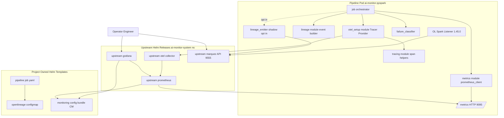
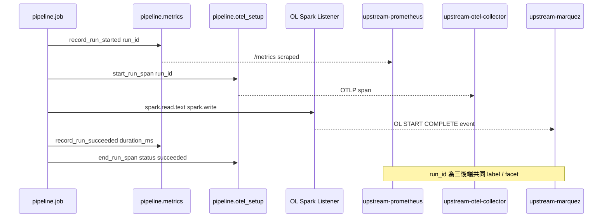
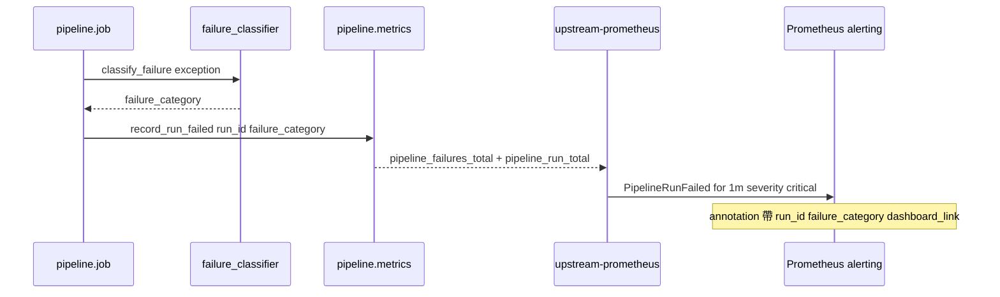
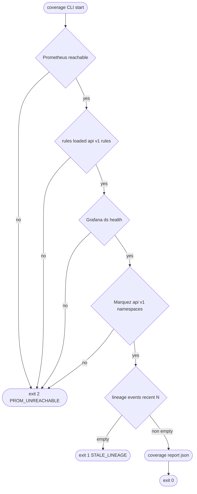
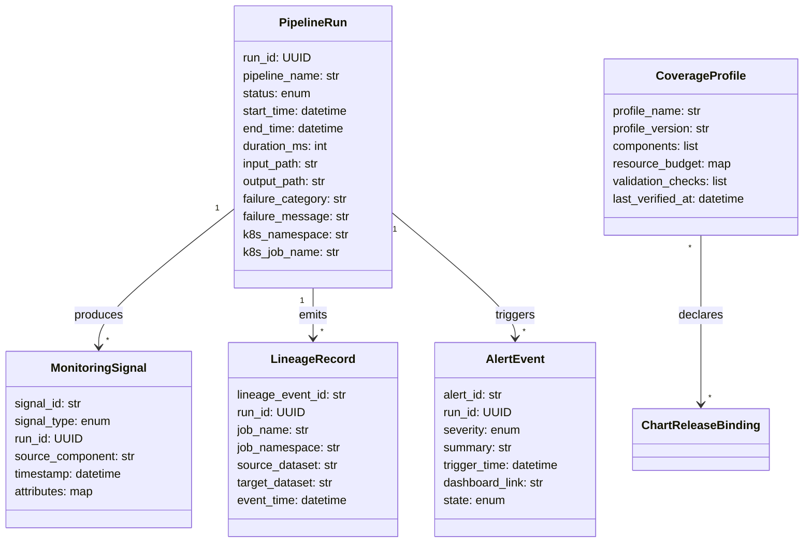
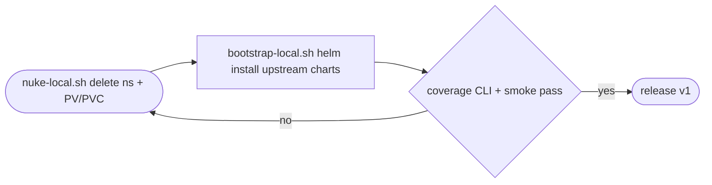

# Technical Design: PySpark Monitoring Framework

**Spec**: `.kiro/specs/pyspark-monitoring-framework/`
**Companion docs**: `requirements.md`、`gap-analysis.md`、`research.md`
**Discovery type**: Light（Extension of `ai-monitor-system/`）
**Language**: zh-TW
**Revision log**:
- 2026-04-17 — initial generation
- 2026-04-18 — design-review revision: (1) `run_id`/`failure_message` 移出 metric labels，改以 OpenMetrics exemplars + alert annotation drilldown 承載；(2) coverage CLI 取消 `helm` CLI 依賴，改讀 Helm release Secret；(3) H1 雙堆疊收斂為 same-PR spike 並自 H1 起 enforce mutex。
- 2026-04-18 — single-stack pivot: 放棄 H1→H2→H3 漸進遷移。Dev 階段允許直接 nuke namespace + PV/PVC；self-managed stack 相關模板、flag、mutex 守門全部移除；上游 chart 為唯一部署路徑。本文件保留 4 個 pipeline 子模組新增/擴充範圍，但 migration 段收斂為單堆疊直切。
- 2026-05-05 — post-restructure path map: commit `6ab73f1` 將 `pipeline/{telemetry,tracing,lineage,lineage_emitter,metrics,otel_setup}.py` 移至 `telemetry/`，將 `pipeline/{io_adapter,scenario_schema,coverage}.py` 移至 `utils/`。本文件保留設計時刻的模組命名（`pipeline.coverage`、`pipeline.tracing` 等）作為設計脈絡；當前實作位置請參照下方 Path Map。

---

## Path Map (post-restructure, commit `6ab73f1`)

設計時本文件描述的所有 `pipeline.<name>` / `pipeline/<name>.py` 引用已遷移；表內為設計階段名稱與當前實作位置的對照。閱讀本文件時請以下表覆寫當前定位。

| Design-time reference         | Current location                                       |
| ----------------------------- | ------------------------------------------------------ |
| `pipeline.telemetry`          | `telemetry/telemetry.py`                               |
| `pipeline.tracing`            | `telemetry/tracing.py`                                 |
| `pipeline.lineage`            | `telemetry/lineage.py`                                 |
| `pipeline.lineage_emitter`    | `telemetry/lineage_emitter.py`                         |
| `pipeline.metrics`            | `telemetry/metrics.py`                                 |
| `pipeline.otel_setup`         | `telemetry/otel_setup.py`                              |
| `pipeline.io_adapter`         | `utils/io_adapter.py`                                  |
| `pipeline.scenario_schema`    | `utils/scenario_schema.py`                             |
| `pipeline.coverage`           | `utils/coverage.py` (CLI: `python -m utils.coverage`)  |

模組行為、責任與契約皆未變動；僅 import path 與檔案位置改變。Contract / integration / smoke tests 已同步更新。

---

## Overview

本框架為 `ai-monitor-system/` 的 PySpark 監控能力 v1，目的是把既有「payload 已建構但未實際送出」的骨架，升級為**可執行期觀測**的最小可信堆疊。對象使用者為平台維運人員、資料工程師、工程主管；workflow 涵蓋失敗偵測、根因分析（lineage + trace）與覆蓋驗證。

設計遵循 `.kiro/steering/` 的 Option B 主軸（上游 Helm chart 為主、專案僅保留 pipeline 與整合 overlay）。Dev 階段直接單堆疊切換：移除 `templates/monitoring-stack.yaml`、`templates/spark-defaults-configmap.yaml`、`monitoring/prometheus/prometheus.yml`、`monitoring/otel/collector-config.yaml`，並由 `deploy/scripts/nuke-local.sh` 負責 namespace + PV/PVC 清場。對既有 `ai-monitor-system` 的影響為：新增 4 個 pipeline 子模組、Helm values 收斂為 chart-side wiring、監控堆疊僅由上游 chart 提供。

### Goals

- 讓 R10 的 5 個指標族（lifecycle / failure / freshness）在 Prometheus 可被查詢；R7 的告警規則被 Prometheus 實際載入並能對失敗 run 觸發 critical alert（含 `run_id`、`failure_category`）。
- 在 OTel SDK 端真正建立 trace span，使 R4 的 `run_id` 跨 metrics / traces / lineage 可在查詢時被驗證。
- 將 `templates/monitoring-stack.yaml` 與上游 chart 的功能重疊收斂為單一來源（Option B 邊界），且不破壞既有 demo 的可重入性。
- 強化 `check-monitoring-coverage` 至 Python CLI，輸出 `coverage-report.json`（含 `chart_version`、`last_verified_at`），可被 contract test 直接 import。

### Non-Goals

- 不引入 Tempo / Jaeger / Loki（v2 候選）。
- 不引入完整 chaos framework；R11 的韌性以兩個腳本場景（pod 重啟、後端短暫 scale 0）為最小證據。
- 不擴展 pipeline 業務邏輯、不支援 streaming、不支援多叢集。
- 不引入 `kube-prometheus-stack`、ServiceMonitor / PodMonitor（與既有 `prometheus-community/prometheus@25.27.0` 不相容）。

## Boundary Commitments

### This Spec Owns

- `ai-monitor-system/pipeline/`：run identity、lifecycle 發送、metrics 暴露端點、OTel SDK Tracer/Meter 初始化、failure 分類、lineage emitter、coverage CLI。
- `ai-monitor-system/deploy/helm/`：chart 組合、四個 upstream chart 的 values overlays、本專案模板（pipeline-job、namespace、openlineage-configmap、新增的 monitoring-config-bundle ConfigMap）。
- `ai-monitor-system/monitoring/`：dashboards、alert rules 的**檔案內容**；以 chart values 自動載入。
- `ai-monitor-system/tests/`：contract / integration / smoke 測試結構與斷言內容。
- 對外契約：`run_id` 為跨訊號 correlation key、5 個指標族命名與 label model、alert payload 必填欄位、CoverageProfile 結構。

### Out of Boundary

- 上游 chart（Prometheus / Grafana / OTel Collector / Marquez）內部行為與升級節奏 → 屬上游維護者。
- Spark 業務邏輯與資料品質檢查 → 不屬此 spec。
- Production 級告警通道（PagerDuty / Slack）整合 → 非 v1。
- Trace 視覺化後端（Tempo / Jaeger）→ 非 v1。
- Pipeline 多管線編排（Airflow / Argo）→ 非 v1。

### Allowed Dependencies

- 上游 Helm charts（已釘版）：`prometheus@25.27.0`、`grafana@8.5.1`、`opentelemetry-collector@0.78.0`、`ilum-marquez@6.7.0`。
- Python 套件：`pyspark>=3.5.0`、`opentelemetry-sdk>=1.25.0`、`opentelemetry-exporter-otlp>=1.25.0`、`prometheus_client>=0.20.0`（**新增**）、`requests>=2.31.0`（**新增**，coverage CLI 用）、`kubernetes>=29.0.0`（**新增**，coverage CLI 讀 Helm release Secret 用）、`pytest>=8.0.0`。
- OpenLineage Spark listener `1.45.0`（透過 Spark JAR）。
- Kubernetes API（namespace、Job、Service、ConfigMap）。

### Revalidation Triggers

- `run_id` label model 改變（會破壞 dashboards / alert annotations / contract test）。
- 5 個指標族命名或 label set 改變（會破壞 dashboards 與 PromQL）。
- AlertEvent payload 必填欄位改變（會破壞 receiver 端契約）。
- Marquez API 路徑或 Service 命名改變（影響 coverage CLI）。
- Helm values flag 命名改變（影響 bootstrap / runbook 步驟）。
- 上游任一 chart 主版號升級 → 觸發 `docs/chart-version-matrix.md` 的相容性重審。

## Architecture

### Existing Architecture Analysis

- **既有結構**：pipeline / deploy / monitoring / tests / docs 五區塊邊界已對齊 steering；payload 構造已就位（`run_context`、`telemetry`、`lineage`、`failure_classifier`），但 emission 鏈路全缺。
- **重疊收斂**：`deploy/helm/templates/monitoring-stack.yaml`、`templates/spark-defaults-configmap.yaml`、`monitoring/prometheus/prometheus.yml`、`monitoring/otel/collector-config.yaml` 已刪除；監控堆疊以上游 chart 為唯一來源。Dev 階段若需重建環境，使用 `deploy/scripts/nuke-local.sh` 直接暴力清除 namespace 與遺留 PV/PVC。
- **保留模式**：lifecycle payload schema、`run_id` 為 UUID、namespace 命名、OL Spark listener 透過 ConfigMap 注入環境變數的整合 bridge。

### Architecture Pattern & Boundary Map

採用「**Driver 內 emitter + 上游 chart wiring**」雙軌：driver process 暴露 metrics 端點與建立 trace；上游 chart 負責收集、儲存與視覺化。`run_id` 為跨訊號的單一相關性鍵。



**Architecture Integration**

- **Selected pattern**：driver-side emission（pull metrics、push traces）+ chart-side wiring（rules、dashboards、scrape）。**單向依賴方向**：`run_context → telemetry/tracing/lineage/failure_classifier → metrics/otel_setup/lineage_emitter → job → 外部後端`；coverage CLI 為獨立旁支，不被任何 emitter 依賴。
- **Domain boundaries**：emission 屬 pipeline；rules/dashboards/scrape 屬 chart values；coverage 屬獨立 CLI。
- **Existing patterns preserved**：`run_id` UUID + 跨訊號穿透、OL Spark listener 為主送出、namespace 命名、values overlay 模型。
- **New components rationale**：`pipeline/metrics.py`（HTTP endpoint + Counter/Histogram）、`pipeline/otel_setup.py`（Tracer/Meter Provider）、`pipeline/lineage_emitter.py`（測試 opt-in shadow emit）、`pipeline/coverage.py`（健康檢查 + chart_version 報告）、`templates/monitoring-config-bundle.yaml`（dashboards + alerts ConfigMap）。
- **Steering compliance**：所有新增模組 < 200 行；保留 pipeline / deploy / monitoring 邊界；不引入新 platform 服務。

### Technology Stack

| Layer | Choice / Version | Role in Feature | Notes |
|-------|------------------|-----------------|-------|
| Pipeline runtime | Python 3.11 + PySpark 3.5.x | run orchestration、emission | 既有；新增 `prometheus_client>=0.20`、`requests>=2.31`、`kubernetes>=29.0` |
| Lineage | OpenLineage Spark listener 1.45.0、Marquez 0.54.0（via `ilum-marquez@6.7.0`） | lineage 事件來源與儲存 | Spark listener 為主、Python emitter 為驗證輔 |
| Tracing | OpenTelemetry SDK 1.25+、OTLP exporter | trace span 與屬性 | Collector exporter 在 v1 為 `logging`（stdout） |
| Metrics | `prometheus_client` HTTP server（port 9095） + Prometheus pull | 5 個指標族暴露 | 與 Spark UI port 4040 不衝突 |
| Deployment | Helm 3 + 4 個上游 chart（已釘版） | chart-side wiring | 啟用 `web.enable-remote-write-receiver` |
| Test | pytest 8.x；contract / integration / smoke 三層 | 行為驗證 | 新增 query-time correlation 測試 |
| Container | `python:3.11-slim` + OpenJDK 21 + OL Spark JAR | image | 既有；新增 `prometheus_client` 至 pip 安裝 |

> 詳細的 chart values 路徑與選型 trade-offs 詳見 `research.md` Topics 1–4。

## File Structure Plan

### Directory Structure

```
ai-monitor-system/
├── pipeline/                         # Driver-side emission（單向依賴：見 Architecture）
│   ├── __init__.py
│   ├── run_context.py                # 既有；不變
│   ├── io_adapter.py                 # 既有；不變
│   ├── failure_classifier.py         # 既有；擴展類別
│   ├── telemetry.py                  # 既有；新增 freshness 計算 helper
│   ├── tracing.py                    # 既有；保留 attribute helper；spans 由 otel_setup 處理
│   ├── lineage.py                    # 既有；不變
│   ├── job.py                        # 既有；改為 orchestration only，呼叫新模組
│   ├── metrics.py                    # 新增：prometheus_client HTTP server + 5 個 collector
│   ├── otel_setup.py                 # 新增：TracerProvider + MeterProvider + OTLP exporter
│   ├── lineage_emitter.py            # 新增：opt-in shadow emit 至 Marquez
│   └── coverage.py                   # 新增：CLI；輸出 coverage-report.json
├── deploy/
│   ├── helm/
│   │   ├── Chart.yaml                # 既有；不變
│   │   ├── Chart.lock                # 既有；不變
│   │   ├── values.yaml               # 修改：upstream-prometheus、upstream-grafana、upstream-otel-collector wiring
│   │   ├── values.local-minimal.yaml # 修改：對齊新 keys
│   │   └── templates/
│   │       ├── namespace.yaml                       # 既有；不變
│   │       ├── pipeline-job.yaml                    # 修改：暴露 9095、加 run_id annotation
│   │       ├── openlineage-configmap.yaml           # 既有；不變
│   │       └── monitoring-config-bundle.yaml        # 新增：dashboards + alert rules ConfigMap
│   │       # monitoring-stack.yaml（已刪除）：以上游 chart 取代
│   │       # spark-defaults-configmap.yaml（已刪除）：未使用
│   └── scripts/
│       ├── bootstrap-local.sh                       # 修改：驗證 flag 互斥
│       ├── run-pipeline.sh                          # 修改：SLA 計時 + 退出碼
│       ├── check-monitoring-coverage.sh             # 退化為 Python CLI 的 thin entry
│       └── run-smoke-test.sh                        # 既有；不變
├── monitoring/
│   ├── alerts/
│   │   ├── pipeline-failure-rules.yaml              # 修改：annotations 加 run_id / failure_category / failure_message
│   │   └── stack-health-rules.yaml                  # 修改：補 PipelineMetricsMissing
│   ├── dashboards/
│   │   ├── pipeline-health.json                     # 修改：補失敗 triage 與 recent runs 表格
│   │   └── lineage-view.json                        # 修改：以 run_id 為入口
│   ├── grafana/
│   │   └── datasources.yaml                         # 既有；不變（會被 chart values inline）
│   # monitoring/otel/collector-config.yaml（已刪除）；collector 由上游 chart values 設定
│   # monitoring/prometheus/prometheus.yml（已刪除）；rules 與 scrape 由 chart values 提供
├── tests/
│   ├── conftest.py                                  # 既有；不變
│   ├── contract/
│   │   ├── test_run_lifecycle_contract.py           # 既有；不變
│   │   ├── test_lineage_contract.py                 # 既有；不變
│   │   ├── test_monitoring_coverage_contract.py     # 修改：強化內容驗證、import coverage CLI
│   │   ├── test_metrics_contract.py                 # 新增：斷言 /metrics 端點 family 與 label
│   │   └── fixtures/
│   │       └── monitoring_payloads.json             # 既有；不變
│   ├── integration/
│   │   ├── test_run_status_flow.py                  # 既有；不變
│   │   ├── test_failure_alerts.py                   # 既有；強化：annotation 模板驗證
│   │   ├── test_lineage_correlation.py              # 既有；不變
│   │   ├── test_trace_attributes.py                 # 既有；新增 SDK span 驗證
│   │   ├── test_telemetry_freshness_warning.py      # 既有；不變
│   │   ├── test_local_profile_readiness.py          # 既有；不變
│   │   └── test_query_time_correlation.py           # 新增：mock 三後端，斷言 run_id 一致
│   └── smoke/
│       ├── test_us1_failure_detection.py            # 既有；不變
│       ├── test_us2_lineage_trace.py                # 既有；不變
│       ├── test_us3_monitoring_coverage.py          # 既有；改為呼叫 coverage CLI
│       ├── test_end_to_end_local_cluster.py         # 既有；強化：以 coverage CLI 驗證 chart_version
│       └── test_resilience_min.py                   # 新增：最小韌性場景
├── docs/
│   ├── chart-version-matrix.md                      # 既有；不變
│   ├── onboarding-monitoring.md                     # 修改：加新 flag 與 metrics 端點
│   ├── runbook.md                                   # 修改：加 trace 觀察、coverage CLI 用法
│   ├── openlineage-spark-config.md                  # 既有；不變
│   ├── validation-report.md                         # 改寫：含實測結果
│   └── README.md                                    # 既有；不變
├── pyproject.toml                                   # 修改：加 prometheus_client、requests
├── ruff.toml                                        # 既有；不變
├── pytest.ini                                       # 既有；不變
└── Dockerfile                                       # 修改：pip 安裝 prometheus_client
```

### Modified Files

- `ai-monitor-system/pipeline/job.py` — 移除 print(payload)，改為呼叫 `metrics.record_*`、`tracing.start_run_span`、`lineage_emitter.maybe_shadow_emit`；保留 orchestration 主流。
- `ai-monitor-system/pipeline/telemetry.py` — 新增 `compute_freshness_seconds(last_event_ts)`、`build_freshness_attributes`。
- `ai-monitor-system/pipeline/failure_classifier.py` — 補 `spark_task_failed` / `spark_driver_error` / `lineage_emission_failed` / `telemetry_unavailable` / `timeout` 類別。
- `ai-monitor-system/deploy/helm/values.yaml` — 加入 `upstream-prometheus.serverFiles."alerting_rules.yml"`、`upstream-prometheus.extraScrapeConfigs`、`upstream-prometheus.server.extraArgs."web.enable-remote-write-receiver"`、`upstream-grafana.datasources` / `dashboardProviders` / `dashboardsConfigMaps`、`upstream-otel-collector.mode` / `config.exporters.prometheusremotewrite`、`pyspark.metricsPort: 9095`。無 migration flag。
- `ai-monitor-system/deploy/helm/values.local-minimal.yaml` — 對齊新 keys；保留 minimal resource budget。
- `ai-monitor-system/deploy/helm/templates/pipeline-job.yaml` — 新增 `containerPort: 9095`、`prometheus.io/scrape=true` annotation、`run-id` annotation 由 entrypoint 注入。
- `ai-monitor-system/deploy/helm/templates/monitoring-stack.yaml` — **已刪除**；監控堆疊由上游 chart 提供。
- `ai-monitor-system/monitoring/alerts/pipeline-failure-rules.yaml` — annotations 加入 `{{ $labels.run_id }}` / `{{ $labels.failure_category }}` / `{{ $labels.failure_message }}`。
- `ai-monitor-system/Dockerfile` — pip 安裝 `prometheus_client`、`requests`、`kubernetes`；**不**安裝 `helm` CLI。
- `ai-monitor-system/pyproject.toml` — 同上新增依賴並補 ruff/pytest 設定（不需異動）。
- `ai-monitor-system/deploy/helm/templates/pipeline-job.yaml` — 補 ServiceAccount 與 namespaced Role（`secrets:get,list`）+ RoleBinding，使 `pipeline.coverage` 可讀 Helm release Secret。
- `ai-monitor-system/deploy/scripts/check-monitoring-coverage.sh` — 退化為 `python -m pipeline.coverage --output ...`。

> 物理檔案責任已映射至 Components；本節避免重述 component-level 行為。

## System Flows

### Flow A — 一次成功 run 的觀測訊號流（Sequence）



決策摘要：metrics 為 pull，trace 為 push；lineage 由 Spark listener 主送出；三條訊號**獨立傳輸但共用 `run_id`**，方便日後並行優化或暫退某一條而不破壞其他兩條。

### Flow B — 失敗 run 與 alert 觸發（Sequence）



> 注意：v1 不引入 Alertmanager 服務；告警以 Prometheus `/api/v1/alerts` 端點為證據。Production 通道為 v2。

### Flow C — Coverage CLI 健康檢查（Process）



決策摘要：CLI 採 fail-fast；對「無近期 lineage」回報為 warning（exit 1）而非 critical，避免 cold-start 期間誤報。

## Requirements Traceability

| Requirement | Summary | Components | Interfaces | Flows |
|-------------|---------|------------|------------|-------|
| 1.1 | Run 起始 lifecycle 事件 | `metrics`, `job` | `MetricsRecorder.record_run_started` | A |
| 1.2 | Run 成功 lifecycle 事件 | `metrics`, `job` | `MetricsRecorder.record_run_succeeded` | A |
| 1.3 | Operator dashboard 顯示識別欄位 | `monitoring/dashboards/pipeline-health.json`, chart `dashboardsConfigMaps` | dashboard panels | A |
| 1.4 | 2 分鐘內可見 | `metrics`, chart `extraScrapeConfigs`（15s scrape） | scrape config | A |
| 2.1 | 失敗 lifecycle 事件 | `metrics`, `failure_classifier`, `job` | `MetricsRecorder.record_run_failed` | B |
| 2.2 | Critical AlertEvent | `monitoring/alerts/pipeline-failure-rules.yaml`, chart `serverFiles."alerting_rules.yml"` | Prometheus alert | B |
| 2.3 | 一致的 failure_category | `failure_classifier` | `classify_failure` | B |
| 2.4 | 後端短暫不可用仍能恢復 | `metrics`, `lineage_emitter` retry, `coverage` | retry policy | C |
| 3.1 | LineageRecord 必填欄位 | `lineage`, OL Spark listener, Marquez | OpenLineage event schema | A |
| 3.2 | run lineage 顯示 | dashboard `lineage-view.json`, Marquez Web UI | dashboard | A |
| 3.3 | 失敗階段對應 lineage | `failure_classifier`, dashboard | dashboard linkage | A,B |
| 3.4 | 亂序事件仍可關聯 | `run_context`, `lineage`, `lineage_emitter` | run_id 共用 | A |
| 4.1 | run_id 為唯一 correlation key | `run_context`, `metrics`, `otel_setup`, `lineage` | label/attribute model | A |
| 4.2 | trace span 屬性 | `otel_setup`, `tracing` | span attributes | A |
| 4.3 | run-scoped signal 必填 run_id | `telemetry`, contract test | `validate_envelope` | — |
| 4.4 | 缺 run_id 可被 contract 偵測 | `tests/contract/test_metrics_contract.py` | pytest assertion | — |
| 5.1 | 上游 chart 部署四件套 | `Chart.yaml`, `values.yaml` | chart deps | — |
| 5.2 | local-minimal profile | `values.local-minimal.yaml` | overrides | — |
| 5.3 | chart 釘版 | `Chart.lock`, `docs/chart-version-matrix.md`, `coverage` 報告 | version pin | C |
| 5.4 | 專案模板限於 pipeline + 整合 | `templates/{pipeline-job, openlineage-configmap, monitoring-config-bundle}.yaml`、移除 monitoring-stack.yaml | helm templates | — |
| 6.1 | 一致狀態語意 | dashboards | grafana panels | A |
| 6.2 | failure triage 視圖 | `pipeline-health.json` | dashboard | B |
| 6.3 | 高峰可用性 | local-minimal 預算 + lazy panel | dashboard | — |
| 6.4 | lineage drilldown | `lineage-view.json` + Marquez link | dashboard | A |
| 7.1 | critical alert summary | alert rules | annotation | B |
| 7.2 | freshness warning | stack-health-rules.yaml + freshness gauge | alert + gauge | C |
| 7.3 | alert payload 含 run_id | alert rules annotation | annotation | B |
| 7.4 | 後端不可用不靜默 | `metrics` graceful retry, `coverage` 警告 | exit codes | C |
| 8.1 | bootstrap 流程 | `bootstrap-local.sh`, `docs/onboarding-monitoring.md` | shell entry | — |
| 8.2 | 不需 one-off 工具 | 標準 chart values + CLI | — | — |
| 8.3 | quickstart + runbook | `docs/runbook.md`, `README.md` | docs | — |
| 8.4 | local-minimal 時程 | `bootstrap-local.sh` 計時 + smoke timing | shell timing | — |
| 9.1 | 必要元件 readiness | `coverage.py` checks 清單 | CLI | C |
| 9.2 | validation_check ↔ 自動化 | `coverage.py` 對應到 contract test | CLI | C |
| 9.3 | chart_version 報告 | `coverage.py` 透過 `helm get metadata` | CLI | C |
| 9.4 | last_verified_at | `coverage-report.json` | report file | C |
| 10.1 | 5 個指標族 | `metrics` collectors | `MetricsRecorder` | A,B |
| 10.2 | 缺指標 family 為 contract 違規 | `tests/contract/test_metrics_contract.py` | assertion | — |
| 10.3 | Grafana / PromQL 一致 | dashboards + datasource | dashboard | A,B |
| 11.1 | 不完整 telemetry 可見 | freshness gauge + warning rule | gauge | C |
| 11.2 | pod 重啟不重複告警 | alert rule `for: 1m`、metrics 重連 | alert rules | B |
| 11.3 | 亂序仍可關聯 | run_id 為 join key | lineage emitter | A |
| 11.4 | 後端短暫離線可恢復 | `metrics` graceful、`coverage` polling | retry | C |
| 12.1 | 自動化測試 | tests/{contract,integration,smoke}/ | pytest | — |
| 12.2 | 文件擁有者與 IO | docs/* 標頭格式 | docs | — |
| 12.3 | 一致狀態與嚴重度語意 | dashboards + alerts | annotation + panels | A,B |
| 12.4 | 釋出前驗證 | smoke + coverage CLI | CLI + pytest | C |

## Components and Interfaces

### Component Summary

| Component | Domain/Layer | Intent | Req Coverage | Key Dependencies (P0/P1) | Contracts |
|-----------|--------------|--------|--------------|--------------------------|-----------|
| `pipeline.metrics` | runtime | 暴露 `/metrics`、提供 5 個 collector 與 lifecycle hook | 1.1, 1.2, 1.4, 2.1, 4.3, 7.4, 10.1, 10.3, 11.1 | `prometheus_client` (P0), `pipeline.run_context` (P0) | Service, State |
| `pipeline.otel_setup` | runtime | 初始化 TracerProvider/MeterProvider 與 OTLP exporter | 4.1, 4.2 | `opentelemetry-sdk` (P0), Collector svc (P1) | Service |
| `pipeline.tracing` | runtime | 提供 span helper（保留 attribute 介面） | 4.2 | `pipeline.otel_setup` (P0) | Service |
| `pipeline.lineage_emitter` | runtime | opt-in shadow emit 至 Marquez（測試輔助） | 3.4, 11.3 | `pipeline.lineage` (P0), `requests` (P0), Marquez (P1) | Service |
| `pipeline.failure_classifier` | runtime | 例外 → failure_category（擴展 Spark/後端） | 2.1, 2.3, 3.3 | — | Service |
| `pipeline.coverage` | ops CLI | 健康檢查 + chart_version 報告 | 5.3, 7.4, 9.1, 9.2, 9.3, 9.4, 11.4, 12.4 | `requests` (P0), `kubernetes` Python client (P0) | Service, Batch |
| `pipeline.job` | runtime | orchestration（呼叫上述模組） | 1.1, 1.2, 2.1, 4.1, 4.2 | 上述全部 (P0) | Service |
| `templates/pipeline-job.yaml` | deploy | k8s Job + scrape annotation | 1.1, 1.4, 4.1, 5.4 | helm (P0), namespace (P0) | Batch |
| `templates/monitoring-config-bundle.yaml` | deploy | dashboards + alert rules ConfigMap | 6.1, 6.2, 7.1, 7.3 | helm (P0) | State |
| `values.yaml` chart wiring | deploy | rules / scrape / dashboards / OTel exporter / flags | 5.1, 5.4, 6.4, 7.2, 9.1, 10.3 | upstream charts (P0) | State |
| `monitoring/alerts/*.yaml` | monitoring | Prometheus rules 內容 | 2.2, 7.1, 7.2, 7.3, 11.1 | Prometheus (P0) | API |
| `monitoring/dashboards/*.json` | monitoring | Grafana panels | 1.3, 3.2, 6.1, 6.2, 6.4 | Grafana (P0) | API |

> 下述詳細區塊僅針對引入新邊界的元件展開。`pipeline.job` 為既有 orchestrator，本設計只異動其呼叫路徑（見 File Structure Plan / Modified Files），不再重複 block。

---

### Pipeline Runtime

#### `pipeline.metrics`

| Field | Detail |
|-------|--------|
| Intent | 在 driver 進程啟動 HTTP server 並提供 5 個 collector 之 lifecycle 寫入 API |
| Requirements | 1.1, 1.2, 1.4, 2.1, 4.3, 7.4, 10.1, 10.3, 11.1 |

**Responsibilities & Constraints**
- 持有所有 `prometheus_client` Collector 物件；唯一暴露 `/metrics`（OpenMetrics 格式以支援 exemplars）。
- Label set 僅限低基數欄位（`status` / `pipeline_name` / `failure_category`）；`run_id` / `failure_message` **不**進入 label，改以 `exemplar=` 參數附加於 `Counter.inc()` / `Histogram.observe()`。違反此約束（將高基數欄位作為 label）於建構時 raise（contract 守門）。
- HTTP server port 預設 9095；可由 env `METRICS_PORT` 覆寫；不與 Spark UI（4040）衝突。
- 暴露端點需以 `CONTENT_TYPE_LATEST = "application/openmetrics-text; version=1.0.0; charset=utf-8"` 提供，否則 exemplars 不會被 Prometheus 寫入。
- 任何寫入失敗以 `try/except` 包覆並透過 logging（含 `run_id` 結構化欄位）記錄；**不**因 metrics 寫入失敗中斷 pipeline 主流（避免造成監控自身阻塞 R7.4 / R11.4）。

**Dependencies**
- Inbound: `pipeline.job` — 呼叫 `record_*`（P0）。
- Outbound: stdlib `http.server` via `prometheus_client.start_http_server`（P0）。
- External: `prometheus_client>=0.20.0`（P0）。

**Contracts**: Service [x] / API [ ] / Event [ ] / Batch [ ] / State [x]

##### Service Interface

```python
# pipeline/metrics.py
from typing import Protocol

class MetricsRecorder(Protocol):
    def start_endpoint(self, *, port: int) -> None: ...
    def record_run_started(self, *, run_id: str, pipeline_name: str) -> None: ...
    def record_run_succeeded(
        self, *, run_id: str, pipeline_name: str,
        duration_seconds: float, records_processed: int,
    ) -> None: ...
    def record_run_failed(
        self, *, run_id: str, pipeline_name: str,
        duration_seconds: float, failure_category: str, failure_message: str,
    ) -> None: ...
    def update_freshness(self, *, run_id: str, seconds_since_last_event: float) -> None: ...
```

- **Preconditions**: `start_endpoint` 必須先呼叫；`run_id` 必為非空字串（將作為 exemplar 而非 label 使用）。
- **Postconditions**: 對應 Counter/Histogram/Gauge 已寫入；family 名稱與 label set（見 Data Contracts 表）穩定；Counter/Histogram 觀測點之 exemplar 含 `run_id` 與（若 trace 已啟用）`trace_id`。
- **Invariants**: 所有 `record_*` 呼叫至少帶有 `run_id`（exemplar）與 `pipeline_name`（label）；`run_id` 出現在 metric label 中視為契約違規（由 `test_metrics_contract.py` 守門）。

##### State Management
- **State model**: 進程內 in-memory Collector registry（由 `prometheus_client` 預設 `REGISTRY`）。
- **Persistence & consistency**: 不持久化；Prometheus 透過 pull 取樣以 15s 為單位。
- **Concurrency strategy**: `prometheus_client` 內建 thread-safe；driver 為單執行緒呼叫，無額外鎖。

**Implementation Notes**
- Integration: 由 `pipeline.job` 在 `run_pipeline()` 入口建立 recorder；Helm `pipeline-job.yaml` 暴露 9095。
- Validation: contract test 透過 `prometheus_client.generate_latest(REGISTRY)`（OpenMetrics 格式）斷言：(a) 5 個 family 名稱完整；(b) label set 不含 `run_id` / `failure_message`；(c) 至少一筆 sample 含 `# {run_id="..."} ...` exemplar 行。
- Risks: 若 driver process 崩潰，metrics 在 scrape 間隔內遺失；以 alert rule `for: 1m` 緩解。

---

#### `pipeline.otel_setup`

| Field | Detail |
|-------|--------|
| Intent | 集中 OTel SDK 初始化，提供唯一的 Tracer 與 resource attributes |
| Requirements | 4.1, 4.2 |

**Responsibilities & Constraints**
- 建立 `TracerProvider` 並掛載 `OTLPSpanExporter`（gRPC，預設 endpoint 由 env `OTEL_EXPORTER_OTLP_ENDPOINT` 提供）。
- Resource attributes 至少含 `service.name=pipeline-job`、`k8s.namespace=ai-monitor-system`、`pipeline.run_id`（動態）。
- 在 driver 進程結束時呼叫 `force_flush(timeout)` 確保 trace 不丟失。

**Dependencies**
- Inbound: `pipeline.tracing`、`pipeline.job`（P0）。
- External: `opentelemetry-sdk`、`opentelemetry-exporter-otlp`（P0）；upstream OTel Collector svc（P1）。

**Contracts**: Service [x] / API [ ] / Event [ ] / Batch [ ] / State [ ]

##### Service Interface

```python
# pipeline/otel_setup.py
from typing import Protocol
from contextlib import AbstractContextManager

class TracerHandle(Protocol):
    def start_run_span(self, *, run_id: str, pipeline_name: str,
                       k8s_namespace: str) -> AbstractContextManager: ...
    def shutdown(self) -> None: ...

def configure_tracer(*, otlp_endpoint: str | None = None) -> TracerHandle: ...
```

- **Preconditions**: 進程僅呼叫 `configure_tracer` 一次；`otlp_endpoint` 為合法 URI 或從 env 取得。
- **Postconditions**: TracerProvider 為 global；後續 `start_run_span` 一律建立含 `run_id` 屬性之 span。
- **Invariants**: 終態 span attributes 必含 `status` 屬性。

**Implementation Notes**
- Integration: `pipeline.job` 於 `run_pipeline()` 開頭呼叫 `configure_tracer()`；使用 context manager 包覆主流。
- Validation: integration test 使用 `InMemorySpanExporter` 取代 OTLP，斷言 span 包含 `run_id` / `pipeline_name` / `k8s_namespace` / `status`。
- Risks: Collector 不可達時 OTLP exporter 會在 `force_flush` 時阻塞；`force_flush(timeout=2)` 限制最大延遲。

---

#### `pipeline.lineage_emitter`

| Field | Detail |
|-------|--------|
| Intent | 在測試環境 opt-in 主動向 Marquez POST 一筆 OL `COMPLETE` 事件，作為 “事件已抵達” 的驗證輔助 |
| Requirements | 3.4, 11.3 |

**Responsibilities & Constraints**
- 預設關閉；以 env `LINEAGE_SHADOW_EMIT=true` 開啟。
- 對 `POST {marquez_url}/api/v1/lineage` 失敗採指數退避 retry（最多 3 次）；失敗以 `lineage_emission_failed` 透過 `failure_classifier` 對應。
- 事件 schema 完全沿用 `pipeline.lineage.build_openlineage_event` 輸出。

**Dependencies**
- Inbound: `pipeline.job`（P0）。
- Outbound: `pipeline.lineage`（P0）、`pipeline.failure_classifier`（P1）。
- External: `requests>=2.31.0`、Marquez API（P1）。

**Contracts**: Service [x] / API [ ] / Event [x] / Batch [ ] / State [ ]

##### Service Interface

```python
# pipeline/lineage_emitter.py
from typing import Protocol

class ShadowEmitter(Protocol):
    def maybe_shadow_emit(self, *, run_id: str, job_name: str,
                          namespace: str, source_dataset: str,
                          target_dataset: str) -> bool: ...
```

##### Event Contract
- Published events: `OpenLineage RunEvent (eventType=COMPLETE)` → `POST /api/v1/lineage`。
- Subscribed events: 無。
- Ordering / delivery guarantees: at-least-once；Marquez 端以 `runId` 自然 upsert，重複不致衝突。

**Implementation Notes**
- Integration: 由 smoke test `test_query_time_correlation.py` 的 fixture 開啟旗標。
- Validation: 對 `requests` 進行 mock；smoke test 在實際叢集中以 `coverage.py` 驗證最近 N 筆事件含相同 `run_id`。
- Risks: 與 Spark listener 雙寫；以 Marquez 自然 upsert 容忍。

---

#### `pipeline.failure_classifier`

| Field | Detail |
|-------|--------|
| Intent | 將 Python / Spark / 後端例外確定性對應至 `failure_category` |
| Requirements | 2.1, 2.3, 3.3 |

**Responsibilities & Constraints**
- 維持既有 4 類；新增 `spark_task_failed`、`spark_driver_error`、`lineage_emission_failed`、`telemetry_unavailable`、`timeout`。
- 以例外 type 為主，輔以 message regex；regex 集中於模組常數區，便於測試。
- 永遠回傳一個非空字串；未知為 `runtime_error`。

**Dependencies**
- Inbound: `pipeline.job`、`pipeline.metrics`、`pipeline.lineage_emitter`（P0）。

**Contracts**: Service [x] / API [ ] / Event [ ] / Batch [ ] / State [ ]

##### Service Interface

```python
# pipeline/failure_classifier.py
from typing import Final

KNOWN_CATEGORIES: Final[frozenset[str]] = frozenset({
    "input_not_found", "invalid_path", "permission_denied",
    "spark_task_failed", "spark_driver_error",
    "lineage_emission_failed", "telemetry_unavailable",
    "timeout", "runtime_error",
})

def classify_failure(error: BaseException) -> str: ...
```

**Implementation Notes**
- Validation: 增加 fixture 涵蓋 `Py4JJavaError`、`requests.exceptions.ConnectionError`、`socket.timeout`；contract test 斷言 `KNOWN_CATEGORIES` 為對外 stable list。

---

### Ops CLI

#### `pipeline.coverage`

| Field | Detail |
|-------|--------|
| Intent | 一支可被 contract test 與 CI 直接呼叫的 CLI，輸出 JSON 報告 |
| Requirements | 5.3, 7.4, 9.1, 9.2, 9.3, 9.4, 11.4, 12.4 |

**Responsibilities & Constraints**
- 順序檢查（fail-fast）：Prometheus → rules → Grafana → Marquez → 最近 lineage。
- 與外部後端通訊一律透過 `requests`，timeout = 5s；總體 polling 上限 30s。
- 報告寫至 `--output PATH`（預設 `.local-data/coverage/<ts>.json`），同時回傳 exit code (`0` ok / `1` warning / `2` critical)。
- 取得 4 個 release 的 `chart_version` 改透過 **Kubernetes API 讀取 Helm release Secret**（Helm 3 將 release metadata 存為 `Secret/sh.helm.release.v1.<release>.v<rev>`，type=`helm.sh/release.v1`，data 欄位為 base64+gzip JSON）。實作以 `kubernetes.client.CoreV1Api.list_namespaced_secret(label_selector="owner=helm,name=<release>")` 取最新 revision，解碼後取 `chart.metadata.version`。**不**呼叫 `helm` CLI、**不**讀 `Chart.yaml`（以叢集實況為準）。
- ServiceAccount 需具備 `secrets:get,list` 於目標 namespace；於 `pipeline-job.yaml` 之 RBAC 補上 Role/RoleBinding（namespaced）。
- 退化路徑：若 in-cluster config 不可用（例如本機 dev 直接執行 CLI），改用 `~/.kube/config`；若仍取不到（例如 CI），於 `validation_checks` 標記 `chart_version_lookup` 為 `warn` 並退回 `chart-version-matrix.md` 解析（exit `1`，非 `2`）。

**Dependencies**
- External: `requests`（P0）、`kubernetes>=29.0.0`（P0，**新增**）、4 個 upstream Service（P0）。

**Contracts**: Service [x] / API [ ] / Event [ ] / Batch [x] / State [ ]

##### Service Interface

```python
# pipeline/coverage.py
from typing import Literal, TypedDict

CheckStatus = Literal["pass", "warn", "fail"]

class CheckResult(TypedDict):
    name: str
    status: CheckStatus
    detail: str

class CoverageReport(TypedDict):
    profile_name: str
    profile_version: str
    last_verified_at: str
    components: dict[str, str]   # component -> chart_version
    validation_checks: list[CheckResult]

def run_coverage(*, namespace: str, marquez_url: str,
                 prometheus_url: str, grafana_url: str) -> CoverageReport: ...
```

##### Batch / Job Contract
- Trigger: 手動 (`python -m pipeline.coverage`) 或 CI step。
- Input / validation: namespace 與 4 個 URL；皆 default 至 in-cluster service DNS。
- Output / destination: `coverage-report.json` + stdout summary。
- Idempotency & recovery: 純讀取；可重入；不修改任何外部狀態。

**Implementation Notes**
- Integration: shell `check-monitoring-coverage.sh` 退化為 thin wrapper；`tests/smoke/test_us3_monitoring_coverage.py` 直接 import `run_coverage`。
- Validation: 對 `requests.get` 與 `kubernetes.client` 進行 mock；契約測試斷言 `CoverageReport.components` 涵蓋 4 個 component 且 `chart_version` 為非空 semver 字串。
- Risks: ServiceAccount 缺 RBAC 權限 → CLI 啟動時即可偵測並回退至 markdown 解析路徑（warn）；不影響 Pipeline 主流。
- Pipeline image 不需安裝 `helm` CLI（移除原 Dockerfile 設想）。

---

### Deployment Layer

#### `templates/monitoring-config-bundle.yaml`（new）

| Field | Detail |
|-------|--------|
| Intent | 把 `monitoring/alerts/*.yaml` 與 `monitoring/dashboards/*.json` 編譯成 ConfigMap，供上游 chart 引用 |
| Requirements | 6.1, 6.2, 7.1, 7.3 |

**Responsibilities & Constraints**
- 兩個 ConfigMap：`{{ .Release.Name }}-pipeline-dashboards`（label `grafana_dashboard=1` 以便 future sidecar 切換）與 `{{ .Release.Name }}-pipeline-alert-rules`（內容直接被 `upstream-prometheus.serverFiles."alerting_rules.yml"` 引用）。
- 內容以 `tpl (.Files.Glob "../monitoring/...").AsConfig` 灌入，**不** hardcode 檔案清單。

**Contracts**: State [x]

**Implementation Notes**
- Integration: chart values 中以 `dashboardsConfigMaps.default: "{{ .Release.Name }}-pipeline-dashboards"`、alert rules 透過 helm `lookup` 或直接內聯。

---

#### `values.yaml` chart wiring（modified）

| Field | Detail |
|-------|--------|
| Intent | 集中所有 chart-side wiring（單堆疊：僅上游 chart） |
| Requirements | 5.1, 5.4, 6.4, 7.2, 9.1, 10.3 |

**Responsibilities & Constraints**
- 頂層 `upstream.*.enabled` 為開關；不提供 self-managed 備援、不提供 migration flag。
- `upstream-prometheus.extraScrapeConfigs`（YAML 字串）以 kubernetes_sd_configs + label `app.kubernetes.io/name=pyspark-pipeline` + port `metrics` 抓取。
- `upstream-prometheus.server.extraArgs."web.enable-remote-write-receiver": null`。
- `upstream-otel-collector.mode: deployment`、`config.exporters.prometheusremotewrite.endpoint: http://ai-monitor-system-upstream-prometheus-server.ai-monitor-system.svc:80/api/v1/write`、`config.exporters.logging.verbosity: detailed`、`config.service.pipelines.metrics.exporters: [prometheusremotewrite]`、`config.service.pipelines.traces.exporters: [logging]`。
- `upstream-grafana.datasources` inline；`dashboardsConfigMaps.default: "{{ .Release.Name }}-pipeline-dashboards"`；`sidecar.dashboards.enabled: false`、`sidecar.datasources.enabled: false`。

**Contracts**: State [x]

**Implementation Notes**
- Integration: `bootstrap-local.sh` 以環境變數 `NUKE_BEFORE_BOOTSTRAP=true` 觸發 `nuke-local.sh` 進行 namespace + PV/PVC 清場後再 `helm upgrade --install`。無 mutex 守門、無 spike 視窗。

---

### Monitoring Assets

#### `monitoring/alerts/pipeline-failure-rules.yaml`（modified）

| Field | Detail |
|-------|--------|
| Intent | 失敗 alert 帶 run_id / failure_category / failure_message annotation |
| Requirements | 2.2, 7.1, 7.3 |

**Contracts**: API [x]

```yaml
groups:
  - name: pipeline-failure
    rules:
      - alert: PipelineRunFailed
        expr: increase(pipeline_failures_total[1m]) > 0
        for: 1m
        labels:
          severity: critical
        annotations:
          summary: "PySpark pipeline {{ $labels.pipeline_name }} failed: {{ $labels.failure_category }}"
          pipeline_name: "{{ $labels.pipeline_name }}"
          failure_category: "{{ $labels.failure_category }}"
          dashboard_link: "http://grafana/d/pipeline-health?var-pipeline_name={{ $labels.pipeline_name }}&from={{ .StartsAt.Unix }}000&to=now"
          runbook_link: "https://docs.example.com/runbook#failure-{{ $labels.failure_category }}"
```

**Implementation Notes**
- Integration: 由 `monitoring-config-bundle.yaml` 灌入 `upstream-prometheus.serverFiles."alerting_rules.yml"`。
- Validation: integration test `test_failure_alerts.py` 驗證 annotation 模板含 `dashboard_link`、`failure_category`、`pipeline_name`，並斷言 alert 不依賴 `$labels.run_id`（後者由 dashboard drilldown 解析）。
- 設計權衡: `run_id` 不在 alert 內直接呈現，需多一跳到 Grafana panel；換得 metric label cardinality 受控、Prometheus 長期可用性提升。詳見 `Data Contracts & Integration` 區塊「Run-level 追蹤路徑」。

#### `monitoring/dashboards/pipeline-health.json`（modified）

採加上 `run_id`、`failure_category`、`failure_message` 三欄之 “Recent Failed Runs” 表格 panel；新增 `pipeline_telemetry_freshness_seconds` 趨勢圖；保留既有 stat。

> 完整 JSON 結構由 implementation 階段直接修改既有檔案；本 design 不重述 panel JSON。

## Data Models

### Domain Model

- **Aggregate root**: `PipelineRun`，由 `pipeline.run_context.RunContext` 持有；所有訊號以 `run_id` 為 join key。
- **Entities**: `PipelineRun`、`MonitoringSignal`、`LineageRecord`、`AlertEvent`、`CoverageProfile`、`ChartReleaseBinding`（沿用 `specs/001-pyspark-monitoring-framework/data-model.md`）。
- **Invariants**:
  - `run_id` 為非空 UUID；於 driver 啟動時生成、注入所有 signal payload 與 trace span。
  - `status` ∈ {`queued`, `running`, `succeeded`, `failed`, `recovering`}；終態須含 `end_time` / `duration_ms`。
  - 失敗 signal 須含 `failure_category` ∈ `failure_classifier.KNOWN_CATEGORIES`。
- **Domain events**: lifecycle metric 寫入、span lifecycle、OL `RunEvent`、Prometheus rule firing。

### Logical Data Model



### Physical Data Model

| Backend | 角色 | 主鍵/索引 |
|---------|------|-----------|
| Prometheus（pull） | metrics 儲存 | series 由 `__name__` + label set；本框架 label 必含 `run_id`、`pipeline_name`、`status` |
| OTel Collector（v1 logging exporter） | trace 暫存於 stdout | trace_id / span_id 由 OTel SDK 生成 |
| Marquez Postgres（chart 自帶） | lineage 持久化 | `run_id` 為外鍵連結 jobs / datasets |
| 本機檔案 | `coverage-report.json` | 路徑 + 時戳 |

### Data Contracts & Integration

- **Metrics 命名與 label set**（**run_id / failure_message 不入 label**，避免高基數）：

  | Family | 型別 | Labels（low-cardinality） | Exemplar attributes |
  |--------|------|---------------------------|---------------------|
  | `pipeline_run_total` | Counter | `status, pipeline_name` | `run_id`, `trace_id` |
  | `pipeline_run_duration_seconds` | Histogram | `status, pipeline_name` | `run_id`, `trace_id` |
  | `pipeline_records_processed_total` | Counter | `pipeline_name` | `run_id`, `trace_id` |
  | `pipeline_failures_total` | Counter | `failure_category, pipeline_name` | `run_id`, `trace_id`, `failure_message`（截斷 80 字元） |
  | `pipeline_telemetry_freshness_seconds` | Gauge | `pipeline_name` | — (Gauge 不支援 exemplar) |

  > 設計理由：依 Prometheus 最佳實務,`run_id`（每 run 唯一 UUID）與 `failure_message`（自由文字）若作為 label 會造成 series 無上限增長與 TSDB 壓力。改以 OpenMetrics **exemplars** 附加於 Counter / Histogram 觀測點（`prometheus_client` 自 0.20 起 `Counter.inc(exemplar=...)` / `Histogram.observe(amount, exemplar=...)` 支援）；Prometheus 25.27.0 啟用 `--enable-feature=exemplar-storage`，Grafana 8.5.1 panel 可顯示 exemplar dot 並跳轉至 trace。R4 跨訊號 correlation 之 `run_id` 由 trace span attributes、OpenLineage facets、driver 結構化 log（JSON）三條路徑共同承載。

- **Alert annotation contract**（彌補 metric label 不再含 `run_id`）：
  - **Critical alert（PipelineRunFailed）**：必含 `summary`、`pipeline_name`（label 直接帶入）、`failure_category`（label 直接帶入）、`dashboard_link`、`runbook_link`。`dashboard_link` 為 Grafana panel URL，帶 `var-pipeline_name` 與 `from`/`to`（alert `$startsAt`/`$endsAt`）參數；操作者於該 panel 之 “Recent Failed Runs” 表（資料來源為 Marquez `/api/v1/events/lineage` + Histogram exemplar 抽樣）解析具體 `run_id` 與 `failure_message`。
  - **Warning alert**：至少含 `summary`、`severity`、`pipeline_name`。
  - **Run-level 追蹤路徑（≤3 跳）**：Alert → Grafana panel（pipeline_name 過濾）→ Marquez lineage-view（同一時間窗）→ `run_id`。`test_failure_alerts.py` 驗證 annotation 模板含 `dashboard_link` 與正確 query 參數。
- **OL event contract**：沿用 `pipeline.lineage.build_openlineage_event`；Spark listener 與 shadow emitter 共用同一 schema。
- **CoverageReport JSON schema**：見 `pipeline.coverage` 介面定義；序列化採 UTC ISO 8601 timestamps。

## Error Handling

### Error Strategy

- **Fail-fast 於進程啟動**：`pipeline.metrics.start_endpoint` 與 `pipeline.otel_setup.configure_tracer` 任一失敗，driver 立即退出（exit 78 = config）；防止「pipeline 跑完但無觀測」。
- **Graceful degradation 於執行中**：metrics 寫入、shadow emit、span 建立失敗皆以 `try/except` 包覆並記錄；**不**中斷 pipeline 主流。
- **Coverage CLI 採三段 exit code**：`0` ok / `1` warning（資料延遲、helm CLI 缺）/ `2` critical（後端不可達、rules 未載入）。
- **Spark listener 錯誤**：listener 屬 JVM 行為，driver 端透過 `failure_classifier` 對 `Py4JJavaError` 中 `OpenLineage` 相關訊息分類為 `lineage_emission_failed`。

### Error Categories and Responses

- **User errors**：`input_not_found` / `invalid_path` / `permission_denied`：以 `pipeline_failures_total{failure_category=...}` + `failure_message` 對外可見；onboarding doc 指引修正路徑與權限。
- **System errors**：`telemetry_unavailable`（OTel/Prometheus）、`lineage_emission_failed`（Marquez）：透過 `pipeline_telemetry_freshness_seconds` 與 stack-health-rules 觸發 warning；coverage CLI 報 `2`。
- **Business rule errors**：本框架不涉入業務語意；保留 `runtime_error` 為 fallback。

### Monitoring

- driver process logs 由 k8s `kubectl logs` 觀察；trace 證據鏈由 Collector logging exporter 留存。
- alert annotations 標準化：`run_id` / `failure_category` / `failure_message` / `dashboard_link`。
- coverage report 提供 release-time 證據；存於 `.local-data/coverage/` 並由 `validation-report.md` 引用最近一筆。

## Testing Strategy

> 對齊 `.kiro/steering/tech.md` 的「contract / integration / smoke」三層；本節僅列**新增或顯著變動**項目，既有測試保留。

- **Unit / Contract Tests**
  1. `test_metrics_contract.py`（新）：`prometheus_client.generate_latest(REGISTRY)` 以 OpenMetrics 格式輸出，斷言 (a) 5 個 family 名稱完整；(b) label set 嚴格符合 Data Contracts 表（`run_id` / `failure_message` **不**得出現於 label）；(c) 至少一筆 Counter / Histogram sample 含 `run_id` exemplar；(d) `pipeline_telemetry_freshness_seconds` 為 Gauge 且不附 exemplar。
  2. `test_run_lifecycle_contract.py`（既有）：保留。
  3. `test_lineage_contract.py`（既有）：保留。
  4. `test_monitoring_coverage_contract.py`（強化）：直接 import `pipeline.coverage.run_coverage` with mock；斷言 `CoverageReport.components` 涵蓋 4 個 component 與 `last_verified_at` 為 ISO 8601。

- **Integration Tests**
  1. `test_query_time_correlation.py`（新）：以 `prometheus_client.REGISTRY` + `InMemorySpanExporter` + mock Marquez，呼叫 `job.run_pipeline`，斷言三後端皆能以同一 `run_id` 查到對應 record。
  2. `test_trace_attributes.py`（強化）：以 `InMemorySpanExporter` 取代純 dict 斷言；驗證終態 span 含 `status`。
  3. `test_failure_alerts.py`（強化）：解析 alert YAML，斷言 `annotations.dashboard_link`、`annotations.failure_category`、`annotations.pipeline_name` 模板字串完整；同時斷言 alert annotation **不**直接引用 `$labels.run_id`（強化 cardinality 守門）。
  4. `test_telemetry_freshness_warning.py`（既有）：保留。

- **Smoke Tests**
  1. `test_us1_failure_detection.py`（既有）：保留。
  2. `test_us3_monitoring_coverage.py`（強化）：呼叫 `coverage.run_coverage`，斷言 `status="pass"` 之數量與 chart_version 報告完整。
  3. `test_resilience_min.py`（新）：以 `subprocess` 執行兩個腳本場景：(a) `kubectl delete pod` pipeline pod，斷言 alert `for: 1m` 不重複；(b) `kubectl scale deploy upstream-otel-collector --replicas=0`，斷言 freshness alert 觸發後恢復。
  4. `test_end_to_end_local_cluster.py`（強化）：以 `time` 包覆 `bootstrap-local.sh + run-pipeline.sh`，斷言總時程符合 R8.4。

- **Performance / Load**：v1 不引入；以 `test_resilience_min.py` 與 SLA 計時為最小代理。

## Migration Strategy

Dev 階段採**單堆疊直切**：放棄 H1/H2/H3 漸進與 feature flag mutex。所有 self-managed 監控堆疊資源（`templates/monitoring-stack.yaml`、`templates/spark-defaults-configmap.yaml`、`monitoring/prometheus/prometheus.yml`、`monitoring/otel/collector-config.yaml`）已刪除，上游 chart 為唯一部署路徑。



**Teardown / rebuild 流程**

1. `NUKE_BEFORE_BOOTSTRAP=true bash deploy/scripts/bootstrap-local.sh` —— 自動執行 nuke 後重建整個 namespace。
2. `bash deploy/scripts/nuke-local.sh` —— 獨立呼叫：強制移除 `ai-monitor-system` namespace、finalize 卡死的 namespace、刪除屬於該 ns 的 PV。
3. 無 rollback 分支；失敗時 nuke 再來一次即可。

**Validation checkpoints**

- `test_metrics_contract.py`（contract 層）通過。
- `test_query_time_correlation.py`（integration 層）通過 —— mock 三後端斷言 `run_id` 一致。
- `coverage.run_coverage` 對 Prometheus / Grafana / Marquez 全回 `pass`。
- `test_resilience_min.py` 與 `test_end_to_end_local_cluster.py` 符合 SLA（bootstrap ≤10 min、success run ≤5 min）。

**Dev-only safety note**

- `nuke-local.sh` 僅供本地 / 開發叢集使用；內含 `kubectl delete ns --wait=false` 與 `replace --raw /finalize` 操作，在共享或生產叢集會造成資料損毀。
- 預設 `NUKE_BEFORE_BOOTSTRAP=false`，需顯式設為 `true` 才會清場。

## Optional Sections

### Performance & Scalability

- **Target metrics**：lifecycle event 在 driver 進程內 < 50 ms；`/metrics` HTTP server 啟動 < 100 ms；coverage CLI 全流程 < 30 s（含 polling）。
- **Scaling**：v1 為單 namespace 單 pipeline；不討論水平擴展。
- **Caching**：N/A；coverage CLI 為 stateless 讀取。

### Security Considerations

- 不引入新外部入口；所有後端皆為 cluster-internal Service。
- `failure_message` 不進入 Prometheus label；以 exemplar 形式攜帶並截斷至 80 字元，避免攜帶 stack trace 中可能的敏感片段（exemplar 仍受 Prometheus exemplar 儲存上限保護）。
- coverage CLI 不寫任何修改性請求（純 GET）；對 Helm release Secret 僅需 `secrets:get,list`（namespaced），不涉及叢集級權限。

> 一般化的 secret / RBAC / image 信任皆延用 steering 與既有平台基線。
